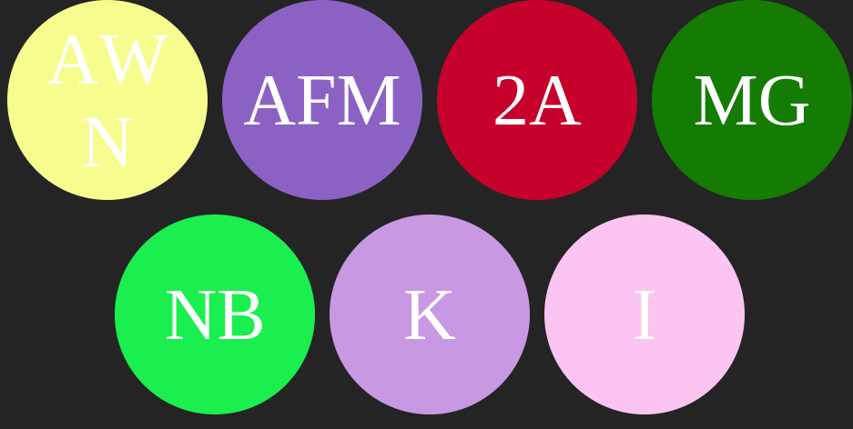

# Generate avatar from text

- It takes an array of names
- Create avatars from the initials

## Examples

- The array

```javascript
const names = [
  "Ahmadou Waly Ndiaye",
  "Adji Fatma Mbacke Thioune",
  "23 a33",
  "Moustapha Gueye",
  "Ndeye Binta",
  " ko",
  "Inno",
];
```

- The result


